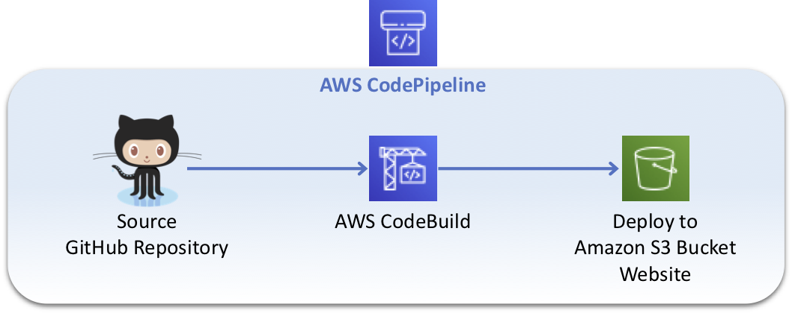
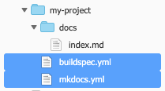
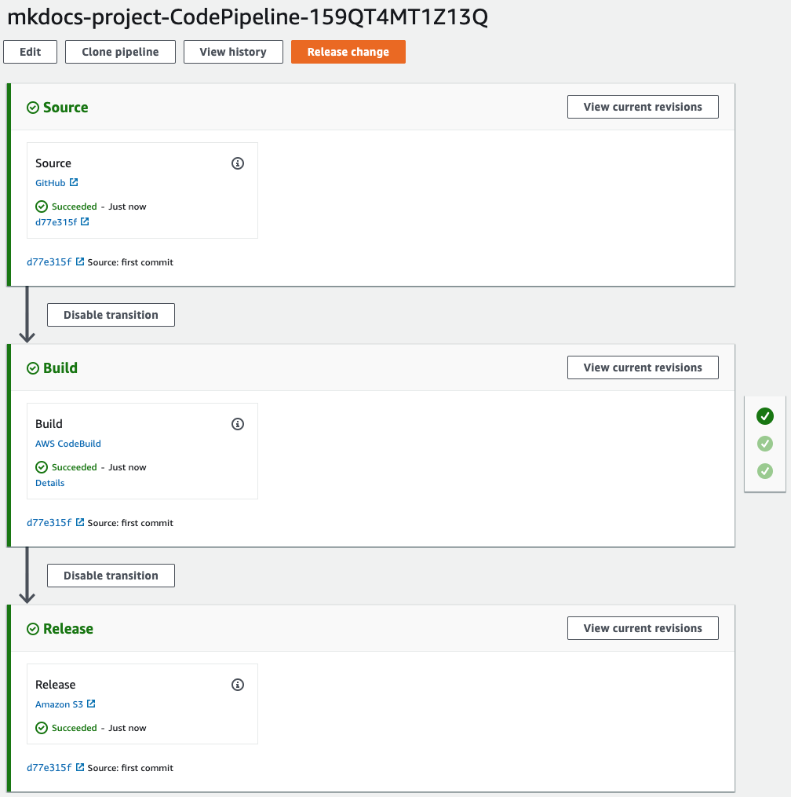
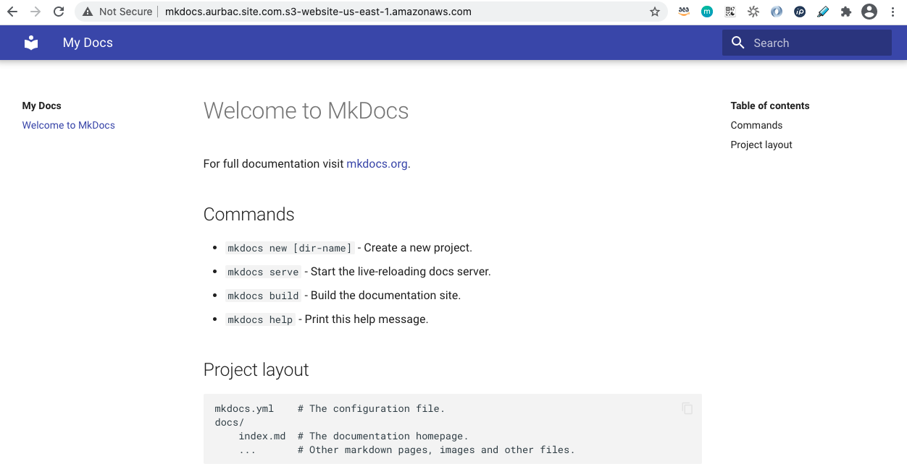

# AWS CodePipeline to Deploy Mkdocs project from GitHub to Amazon S3 Bucket



## Create a personal access token for GitHub

You need a personal access token for GitHub and must have the following scopes.

* **repo**: Grants full control of private repositories.
* **repo:status**: Grants access to commit statuses.
* **admin:repo_hook**: Grants full control of repository hooks. This scope is not required if your token has the repo scope.

https://help.github.com/en/articles/creating-a-personal-access-token-for-the-command-line

## Create you first Mkdocs project

Install the mkdocs and material design package using pip.

``` bash
sudo pip install mkdocs
sudo pip install mkdocs-material
```

https://www.mkdocs.org

https://squidfunk.github.io/mkdocs-material/

Create the Mkdocs project.

``` bash
mkdocs new my-project
cd my-project
```

Append the following line to your project's mkdocs.yml.

``` yml
theme:
  name: 'material'
```

Create a new **buildspec.yml** file inside your project with the following lines.

``` yml
version: 0.2
phases:
  install:
    runtime-versions:
      python: 3.7
    commands:
      - pip install --upgrade pip
      - pip install --upgrade awscli
      - pip install mkdocs
      - pip install mkdocs-material
  pre_build:
    commands:
      # Discover and run unit tests in the 'tests' directory
  build:
    commands:
      # Build
      - mkdocs build
  post_build:
    commands:
      # Post Build

artifacts:
  base-directory: 'site*'
  files:
    - '**/*'
```

Your project files.



Now create a new GitHub repository for your mkdocs project and push the changes.

## Create the CodePipeline to deploy changes automatically to your Amazon S3 Website

Download the CloudFormation template [AURBAC-mkdocs-codepipeline-github-to-s3.json](AURBAC-mkdocs-codepipeline-github-to-s3.json) and launch in your selected region to create the AWS CodePipeline and an Amazon S3 Bucket for your WebSite, specify the following values:

* GitHubRepo (Repository name)
* GitHubBranch
* GitHubOwner (Github User)
* GitHubOAuthToken
* WebsiteDomain (Bucket name)

Wait until stack status is **CREATE_COMPLETE** and go to the AWS CodePipeline console, automatically the pipeline release a change and deploy to your Amazon S3 Bucket.



In the **Outputs** of your CloudFormation Stack you will find the link to your Website.

